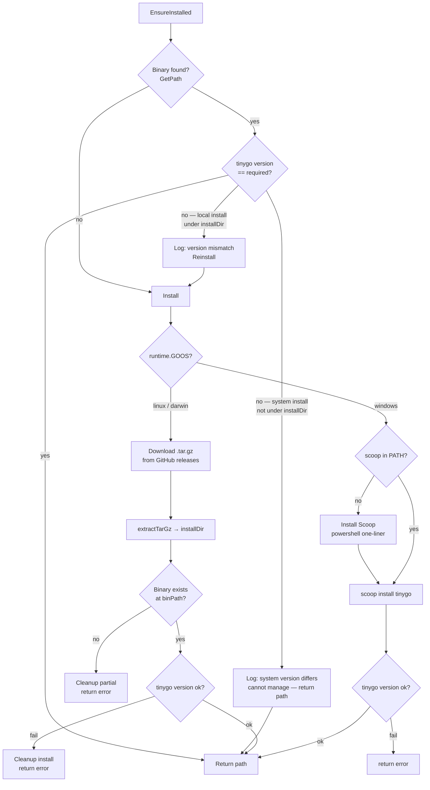

# Install Flow

## Version matching rule

`DefaultVersion = "0.40.1"` is the required version.

| Situation | Action |
|-----------|--------|
| Installed version == `DefaultVersion` | Use as-is |
| Installed version ≠ `DefaultVersion` — **system install** (found in PATH, not under `installDir`) | Log warning, use as-is — cannot manage system packages |
| Installed version ≠ `DefaultVersion` — **local install** (under `installDir`) | Reinstall the correct version |
| Not installed | Install |
