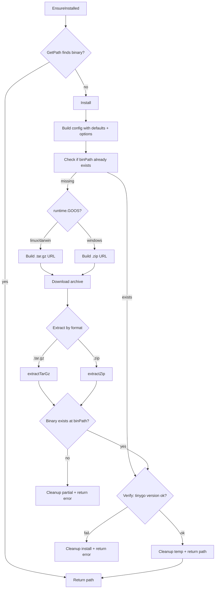

# Install Flow

```mermaid
flowchart TD
    A[EnsureInstalled] --> B{GetPath finds binary?}
    B -->|yes| C[Return path]
    B -->|no| D[Install]
    D --> E[Build config with defaults + options]
    E --> F[Check if binPath already exists]
    F -->|exists| V{Verify: tinygo version ok?}
    F -->|missing| G{runtime.GOOS?}
    G -->|linux/darwin| H[Build .tar.gz URL]
    G -->|windows| I[Build .zip URL]
    H --> J[Download archive]
    I --> J
    J --> K{Extract by format}
    K -->|.tar.gz| L[extractTarGz]
    K -->|.zip| M[extractZip]
    L --> N{Binary exists at binPath?}
    M --> N
    N -->|no| P[Cleanup partial + return error]
    N -->|yes| V
    V -->|ok| O[Cleanup temp + return path]
    V -->|fail| Q[Cleanup install + return error]
    O --> C
```
